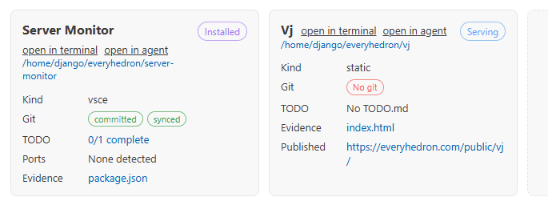

- [ ] SKIP FOR NOW: if the current installation of a vsce is stale, the window hasnt reloaded since last time, change the Installed button to a clickable Stale button that reloads the window
- [x] shorted "open in terminal/agent" to just "terminal" "agent", put them to the right of the project name, instead of wrappable . make them lighter in color. if the name is too long, we can afford using "..." to clip off some chars, but do not wrap the terminla/agent links. also align them right, should be closer to the status tag than the name.
- [x] add a field to detect a README.md field named README, if available we display a truncated version of the description which should usually be the first paragraph after the first heading. when one hovers the truncated, it will show the full section between the first and second heading. if readme available, use the first heading as the project name instead of a plain propercase. if the propercase and the one in readme is not the same, display the project name as red, use the readme name, when hovering, it will show what each are. we can click on the truncated text to open the readme file. it should have a hover effect of an underline and default to just plain regular color text. 
- [x] why do we have unpushed and unsynced, are they not the same thing? can we just keep the sync terminology?
- [x] for this part "Refreshes every 30s on Projects." change it to Refreshing in `countdown`s. 
- [x] for this part "0 selected. 23 projects tracked, 4 running, 11 serving, 3 installed, 0 stale. " just say 23 tracked, no "project". and for the specific category of status, make them a hover tooltip when one hovers on the 23 tracked. also include how many stopped, basically all available status should each be on one line. 
- [x] add to the status bar a quick section similar to each in /home/django/everyhedron/server-monitor. we want to show just how many are good (not stopped or stale) so numgood/totalprojectnum, when hovering, it will show the same as the one we implemented on page which is for each status category. when clicked on, it will open the project monitor page
- [x] if we are opening agent in the terminal, check vscode terminal if it already exists, if so we simply focus it. same with open terminal.
- [x] this is the git remote for this project "git@github.com:everyhedron/project-monitor.git" there is a MIT License on the remote. configure it. tage all changes, commit, and push
- [x] your thought here "• Patch is in. I changed “unpushed” to “sync needed” and “unsynced” to “sync unknown”; kept “behind”
  because that is a different sync direction signal, but it still belongs to sync terminology. Next I’m
  marking the TODOs complete and compiling." confused me a little. please write below this item, the current possible git statuses and their logic in whether they can coexist, what git command proves each. 
  - First segment, local working tree state, comes from `git -C <project> status --porcelain=v1 --branch --untracked-files=no`.
  - `No git`: no `.git` metadata or not inside a git work tree. Proven by `.git` lookup plus `git -C <project> rev-parse --is-inside-work-tree`.
  - `unstaged`: at least one porcelain line has an unstaged marker in column 2, or starts with `??`. This wins over `uncommitted`, so they do not display together.
  - `uncommitted`: at least one porcelain line has a staged marker in column 1, and no unstaged/untracked changes. This means all detected changes are staged.
  - `committed`: no porcelain change lines and no remote. If a remote exists, a clean tree is represented by `synced` or `unsynced` instead.
  - Second segment, remote sync state, comes from `git -C <project> remote`, `git -C <project> rev-parse --abbrev-ref --symbolic-full-name @{u}`, and the ahead/behind markers in the same `git status --porcelain=v1 --branch --untracked-files=no` branch header.
  - `no remote`: no remote and no upstream. This excludes all sync statuses.
  - `unsynced`: remote/upstream exists, but local changes, ahead commits, behind commits, or an otherwise unproven sync state mean the repo is not proven current.
  - `synced`: remote/upstream exists, no uncommitted changes, and ahead/behind are both zero.
- [x] whether it is sync needed, behind, or sync unknown, all should say "unsynced". committed can only exist when there is "no remote", otherwise it automatically walks up to be unsynced or synced.
