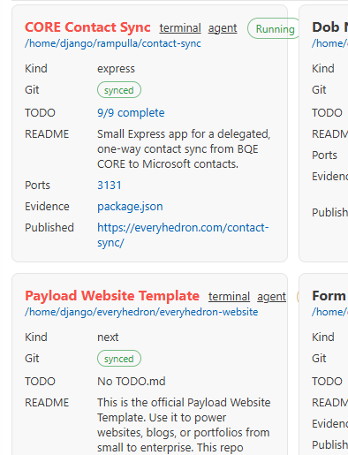

- [x] are we able to see if a vsce is published? if so make the vsce project card document that. in the version line, if its published make the text green. if the published version is not the latest version, make the text yellow.
- [ ] for the version line make it ver-installed / lastest-ver-published. so if ver installed is larger than latest ver published, we know the publication is stale so we make the own ver / ver text yellow. and if they are the same we have them green. if published is higher than ver installed, make it yellow as well. if its never published, make it verinstalled / "unpublished" and make the line red. and if uninstalled make it "uninstalled" / pubver. basically if the two numbers match its green, if dont match but have value, its yellow. if any doesnt have value its red.
- [ ] We are moving towards publication. the first published version would be 0.0.1, therefore remove all local old builds. keep updating 0.0.1 until the moment of publication. reference agent-monitor which is already published. we would like to scafold a changelog, but since we are just updating one version, we dont need to have anything in there. make readme reflect latest features. check source code, readme, and git history to flag sensitive data, such as contact, secrets, personal folder paths, domains, etc. pipe the actual sensitive data to a file under .codex, and write below the path to it.
- [ ] for README.mds that use html, can we strip the tags from the display? like here its ugly "A VS Code dashboard for keeping track of local <strong>Codex</strong> and <strong>Claude Code</strong> sessions - what's running, what's requesting a..." 
